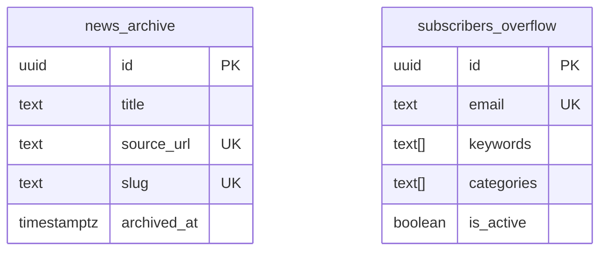
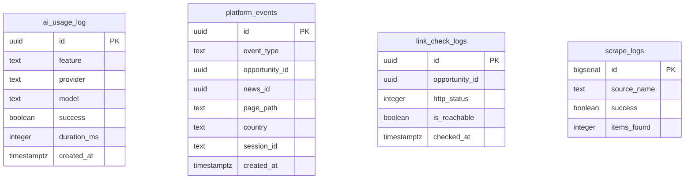
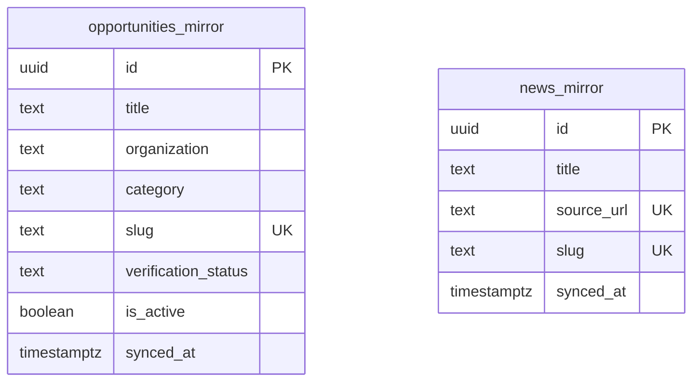

# Entity-Relationship Diagram

## DB1 — Supabase Primary (Core Platform + Social)

```mermaid
erDiagram
    opportunities ||--o| companies : "organization_id"
    opportunities ||--o| company_pages : "company_page_id"
    opportunities ||--o{ link_check_results : "id"
    opportunities ||--o{ opportunity_reports : "id"
    
    companies ||--o{ scraper_sources : "id"
    companies ||--o{ opportunities : "id"
    
    news_articles {
        uuid id PK
        text title
        text slug UK
        text summary
        text source_name
        text url UK
        timestamptz published_at
    }
    
    opportunities {
        uuid id PK
        text title
        text organization
        uuid organization_id FK
        text category
        text location
        text stipend
        date deadline
        text apply_link
        text source_url UK
        text slug UK
        text verification_status
        boolean is_active
        timestamptz posted_at
    }
    
    companies {
        uuid id PK
        text slug UK
        text name
        text company_type
        text industry
        boolean is_verified
    }
    
    company_pages {
        uuid id PK
        text slug UK
        text name
        text industry
        text company_type
        integer follower_count
    }
    
    company_pages ||--o{ company_followers : "id"
    
    company_followers {
        uuid id PK
        uuid company_id FK
        uuid user_id FK
    }
    
    learning_tracks ||--o{ learning_days : "id"
    learning_tracks ||--o| track_assessments : "id"
    learning_days ||--o{ learning_resources : "id"
    learning_days ||--o{ learning_questions : "id"
    
    user_profiles ||--o| user_resumes : "id"
    user_profiles ||--o{ saved_opportunities : "id"
    user_profiles ||--o{ applications : "id"
    user_profiles ||--o{ user_alerts : "id"
    user_profiles ||--o{ feed_posts : "user_id"
    user_profiles ||--o{ notifications : "user_id"
    user_profiles ||--o{ conversations : "participant_1/2"
    user_profiles ||--o{ connection_requests : "sender_id"
    user_profiles ||--o{ user_follows : "follower_id"
    user_profiles ||--o{ skill_endorsements : "profile_owner_id"
    user_profiles ||--o{ recommendations : "recipient_id"
    user_profiles ||--o{ community_posts : "user_id"
    
    feed_posts ||--o{ feed_post_likes : "id"
    feed_posts ||--o{ feed_post_comments : "id"
    feed_posts ||--o{ feed_post_reposts : "id"
    
    conversations ||--o{ messages : "id"
    
    community_posts ||--o{ community_comments : "id"
    community_posts ||--o{ community_votes : "id"
    
    connection_requests ||--o| connections : "accepted"
    
    user_profiles {
        uuid id PK FK
        text username UK
        text full_name
        text headline
        text avatar_url
        text city
        text country
        boolean is_open_to_work
        integer follower_count
        integer following_count
        integer connection_count
    }
    
    feed_posts {
        uuid id PK
        uuid user_id FK
        text content
        text post_type
        integer likes_count
        integer comments_count
        text visibility
    }
    
    conversations {
        uuid id PK
        uuid participant_1 FK
        uuid participant_2 FK
        timestamptz last_message_at
    }
    
    messages {
        uuid id PK
        uuid conversation_id FK
        uuid sender_id FK
        text content
        boolean is_read
    }
    
    notifications {
        uuid id PK
        uuid user_id FK
        text type
        uuid actor_id FK
        boolean is_read
    }
```

## DB2 — Supabase Secondary (Archive)



## NEON1 — Analytics



## NEON2 — Cache / Mirror



## Cross-Database References

| Source | Column | Target | Type |
|--------|--------|--------|------|
| DB1.opportunities | `source_url` | DB1.news_articles.`source_url` | Logical (dedup) |
| DB1.saved_opportunities | `opportunity_id` | DB1.opportunities.`id` | Logical (no FK) |
| DB1.applications | `opportunity_id` | DB1.opportunities.`id` | Logical (no FK) |
| DB1.feed_posts | `opportunity_id` | DB1.opportunities.`id` | Logical (no FK) |
| DB2.news_archive | (data from) | DB1.news_articles | Sync via cron |
| NEON2.opportunities_mirror | (data from) | DB1.opportunities | Sync via cron |
| NEON2.news_mirror | (data from) | DB1.news_articles | Sync via cron |

> Note: Cross-database foreign keys are not possible. References are enforced at the application layer.
